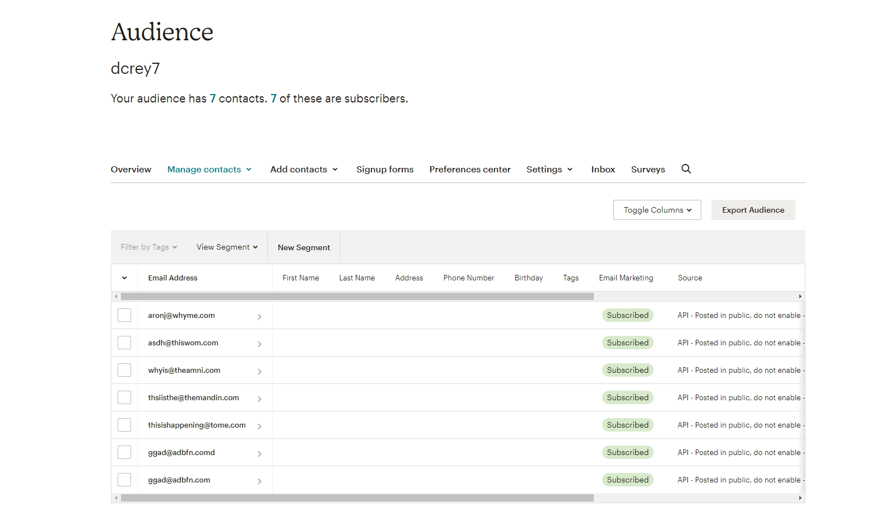

# newsletter_signup

website will be available when the mailchimpapi is enabled, will get a success page if you are added to the list and will display failure page if it does not. If it does not work contact me.

- https://newsletter170.herokuapp.com/

- https://thawing-mesa-56139.herokuapp.com/

- <h1>Landing page</h1>

- <h1>Success page</h1>

- <h1>Error page</h1>

- <h1>mailchimp API maillist</h1>

